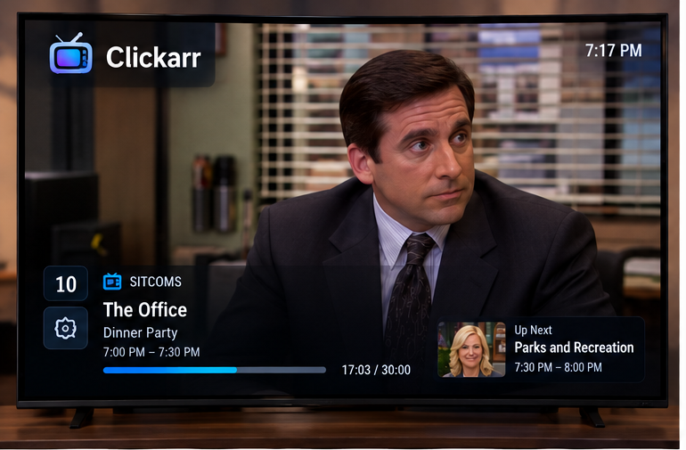
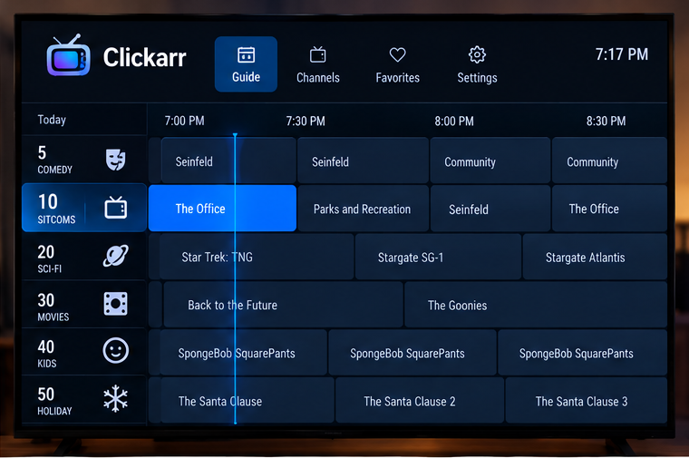
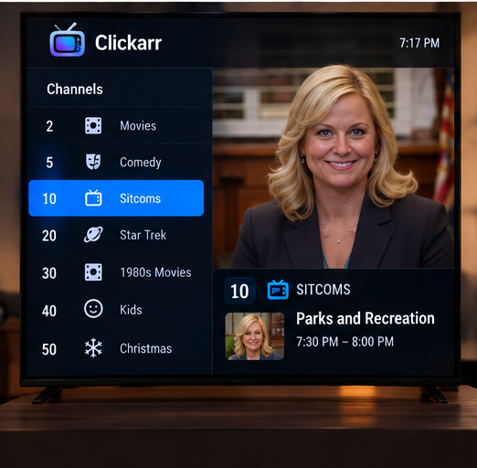
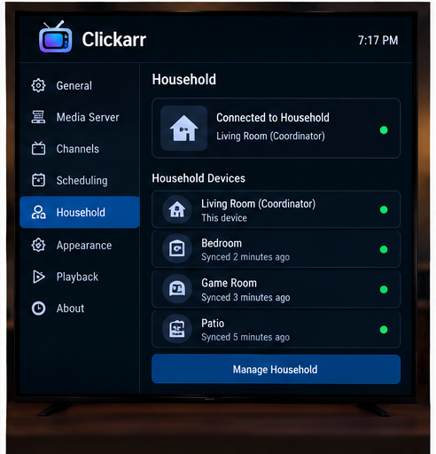
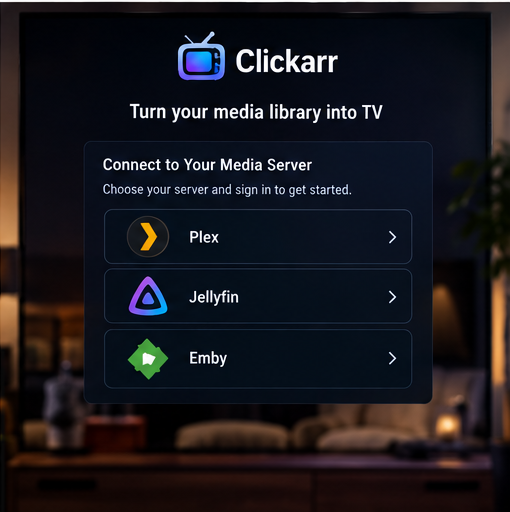

<p align="center">
  
</p>

<h3 align="center">Turn your media library into TV.</h3>

<p align="center">
  An open-source Android TV app that gives your Plex library a channel lineup, a program guide, and a remote-control experience. Something is always on. Just change the channel.
</p>

<p align="center">
  <a href="LICENSE"></a>
  
  
  <a href="https://clickarr.net"></a>
  
</p>

---

## The idea

Media servers all work the same way: open the app, browse, pick a show, pick an episode, press play. That is a video store, not television.

Clickarr flips it:

**Open the app. Something is already playing. Change channels. Watch.**

You build virtual channels out of your own library. Channel 10 is sitcoms, channel 20 is Star Trek, channel 50 is Christmas movies in December. Each channel runs a schedule. Tune to channel 10 at 7:17 PM and you land seventeen minutes into whatever is airing, exactly like turning on a TV. Leave and come back later and the channel has kept going without you.

<p align="center">
  
</p>

## What it looks like

These are the design mockups the app is being built to. They are direction, not screenshots yet.

<table>
  <tr>
    <td width="50%"><br><sub><b>Guide.</b> A real grid with a now-line, half-hour columns, and D-pad navigation that behaves like a cable box.</sub></td>
    <td width="50%"><br><sub><b>Channels.</b> Your lineup with numbers, icons, and a preview of what each channel is airing right now.</sub></td>
  </tr>
  <tr>
    <td width="50%"><br><sub><b>Household.</b> Several TVs in one home share channels and agree on the schedule. No extra server required.</sub></td>
    <td width="50%"><br><sub><b>Setup.</b> Sign in to Plex and start building channels.</sub></td>
  </tr>
</table>

## Website

[clickarr.net](https://clickarr.net) is the project's home on the web: the pitch, the screens, and a one-line way to get the latest nightly build onto a Fire TV (`clickarr.net/nightly` in the Downloader app). It is a static page in [`site/`](site/) in this repo, deployed by GitHub Pages on every push.

## How it works

Clickarr is a single APK. There is no Clickarr server, container, or cloud account.

```text
                     Plex Media Server
                             │
                             │  metadata + direct video stream
                             ▼
                      ┌──────────────┐
                      │ Clickarr APK │
                      │  channels    │
                      │  scheduler   │
                      │  guide       │
                      │  player      │
                      └──────────────┘
```

A few decisions shape everything else:

- **A channel is a function from time to program.** Schedules are never stored or synced. They are recomputed from a frozen lineup, a start time, and a seed, so every device gets the same answer for "what is on channel 10 at 7:17 PM" without talking to each other.
- **Video goes straight from your server to the TV.** Clickarr never proxies media. The server still does direct play or transcoding, Clickarr just asks for the right item at the right offset.
- **Multiple TVs form a household over the LAN.** One TV coordinates, the others cache the lineup and keep working if it is off. Pairing uses a PIN plus a pinned certificate so a random device on your Wi-Fi cannot join.
- **Media server credentials never leave the device they were entered on.** Each TV signs in itself. A household shares channels, not tokens.
- **Fire TV is a first-class target.** Nothing depends on Google Play Services. Sideload the APK and go.

The full reasoning, with the options that were considered and rejected, is in the [architecture proposal](docs/architecture-proposal.md). The living summary is [docs/architecture.md](docs/architecture.md), and each decision has an [ADR](docs/adr/README.md).

## Planned features

Phase 1 and 2 (the MVP) prove the core experience. Everything else lands after.

| Now | Later |
|---|---|
| Channels from shows, libraries, Plex collections, playlists, genre/decade/label filters, hand-picked lists, and combinations of those | Smart rules that re-evaluate automatically as the library grows |
| Sequential and shuffled lineups | Time blocks, day-of-week schedules, fixed-time programs |
| Half-hour slot padding with filler cards | Marathons, holiday programming, interstitials and bumpers |
| Grid guide, overlay, channel surfing, numeric entry | Live preview while browsing channels, favorites filter |
| Household pairing and sync across TVs | Coordinator migration, viewing history |
| Resume last channel on launch | Watched-state reporting to your server |

## Platforms

| Target | Status |
|---|---|
| Android TV / Google TV (Android 7.1+) | Planned for first release |
| Amazon Fire TV (Fire OS 6+) via sideload | Planned for first release, tested on real sticks |
| Phones, tablets, web, Apple TV | Not planned. Clickarr is a television interface. |

## Status

Pre-alpha, Phase 1 in progress. A nightly debug build exists and already does the core loop: sign in to Plex, create a channel from shows, a library with filters, a collection, or a playlist, and watch it with the overlay and a program guide. It is rough, untested on real hardware beyond CI, and changes daily. Get it from the [nightly pre-release](https://github.com/thegregstengel/clickarr/releases/tag/nightly) or `clickarr.net/nightly` in the Fire TV Downloader app. Phase 0 spikes (device measurements) still need to be run; they live under Settings in the app. Roadmap: [proposal section 20](docs/architecture-proposal.md#20-phased-mvp-roadmap).

## Documentation

- [Architecture overview](docs/architecture.md)
- [Architecture proposal](docs/architecture-proposal.md) (the approved original, with every option and tradeoff)
- [Architecture decision records](docs/adr/README.md)
- [Design language](docs/design/design-language.md) and [mockups](docs/design/README.md)
- [Brand assets](brand/README.md)

## Contributing

Clickarr is developed in the open and contributions are welcome once the Phase 1 code lands. Until then, issues and design discussion are the best way to help. Two rules that will not change: no code copied from other media clients (Clickarr is MIT and stays clean-room), and no secrets or server tokens in the repo, ever.

## License

MIT. See [LICENSE](LICENSE). Inter is bundled under the SIL Open Font License. Plex is a trademark of Plex, Inc.; Clickarr is an independent project and is not affiliated with or endorsed by Plex.
