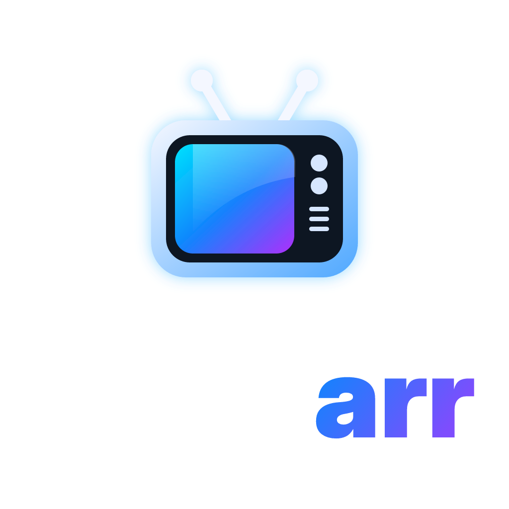
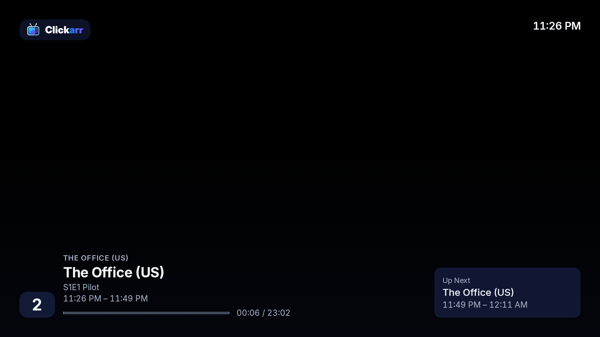
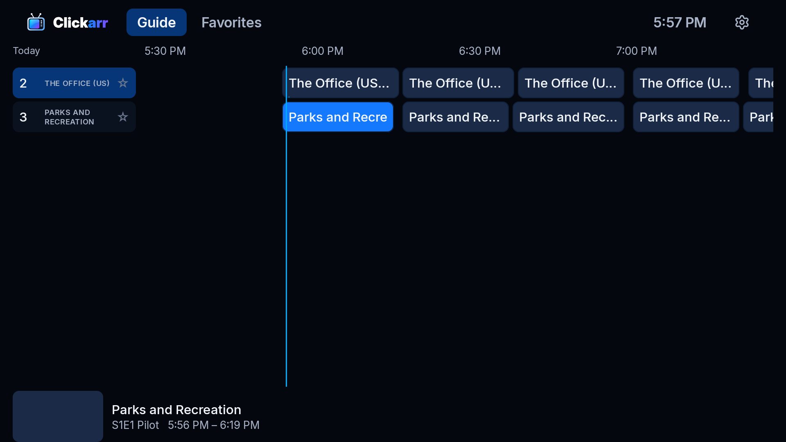
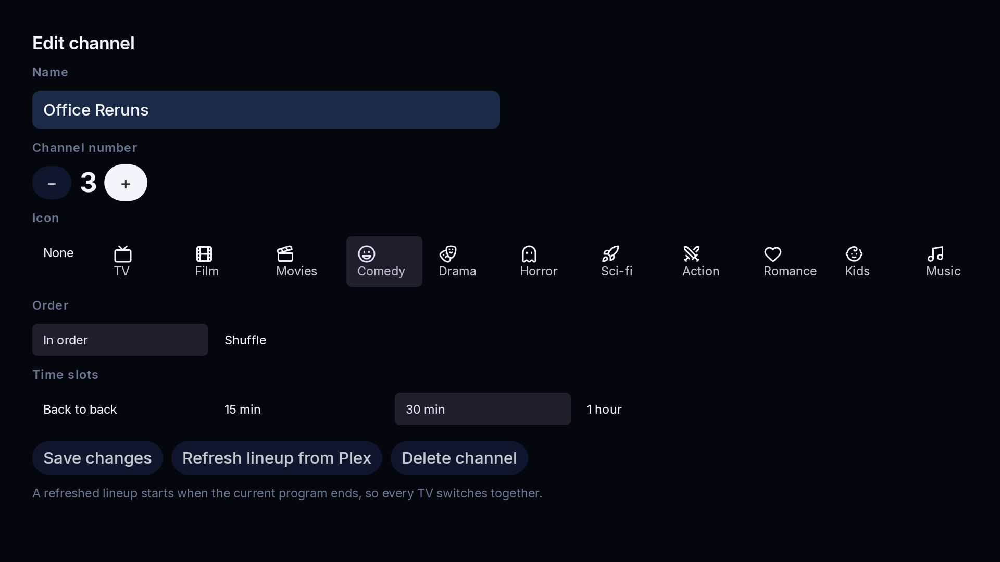
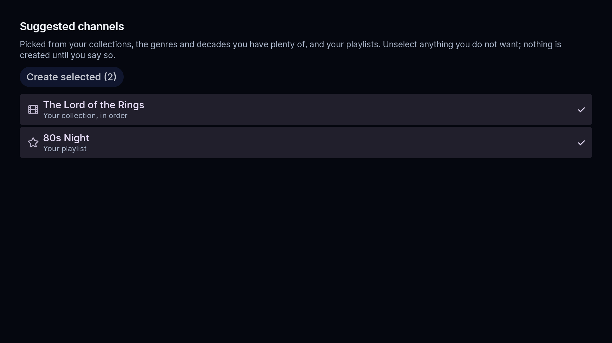
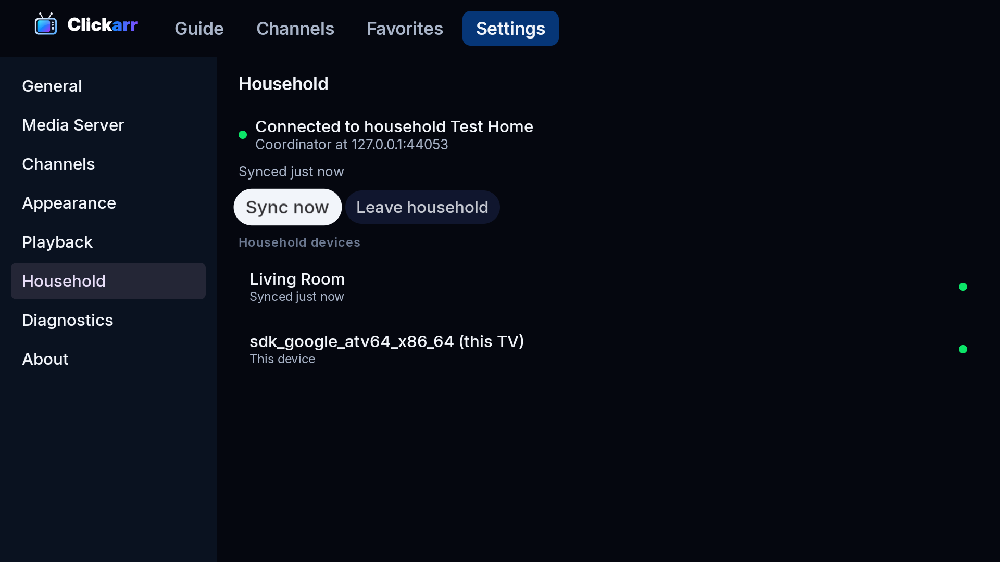

<p align="center">
  
</p>

<h3 align="center">Turn your media library into TV.</h3>

<p align="center">
  An open-source Android TV app that gives your Plex library a channel lineup, a program guide, and a remote-control experience. Something is always on. Just change the channel.
</p>

<p align="center">
  <a href="LICENSE"></a>
  
  
  <a href="https://clickarr.net"></a>
  
</p>

---

## The idea

Media servers all work the same way: open the app, browse, pick a show, pick an episode, press play. That is a video store, not television.

Clickarr flips it:

**Open the app. Something is already playing. Change channels. Watch.**

You build virtual channels out of your own library. Channel 10 is sitcoms, channel 20 is Star Trek, channel 50 is Christmas movies in December. Each channel runs a schedule. Tune to channel 10 at 7:17 PM and you land seventeen minutes into whatever is airing, exactly like turning on a TV. Leave and come back later and the channel has kept going without you.

<p align="center">
  
</p>

## What it looks like

Screens from the app as it stands, taken on the Android TV emulator by the test suite on every push.

<table>
  <tr>
    <td width="50%"><br><sub><b>Guide.</b> Two hours across, a now-line, a preview card with artwork and synopsis for the focused program, stars on the channel column for favorites.</sub></td>
    <td width="50%"><br><sub><b>Channel editor.</b> Shows, a library with genre and decade filters, a collection, or a playlist; in order or shuffled; episodes in a row; back to back or on the half hour.</sub></td>
  </tr>
  <tr>
    <td width="50%"><br><sub><b>Suggest channels.</b> A practical starting lineup from what you own: rerun channels, collections, genre themes, decades, a movie channel.</sub></td>
    <td width="50%"><br><sub><b>Household.</b> Several TVs in one home share channels and agree on the schedule over your Wi-Fi. No extra server required.</sub></td>
  </tr>
</table>

## Get it

Clickarr is a single APK that you sideload. There is no Clickarr server, container, or cloud account.

- **Nightly** (debug build of `main`, changes daily): in the Fire TV Downloader app enter `clickarr.net/nightly`, or fetch it from the [nightly pre-release](https://github.com/thegregstengel/clickarr/releases/tag/nightly). Once installed, Settings, About updates Clickarr in place from then on.
- **Release**: the first tagged release is next on the list. `clickarr.net/apk` will point at it.

Nightlies are signed with one long-lived key, so each one installs over the last. Release builds use a different key; switching channels means uninstalling once.

## What it does today

Everything below is in the nightly and has been exercised on real Fire TV Sticks as well as the emulator.

- **Channels** from shows, whole libraries with genre and decade filters, Plex collections, playlists, and hand-picked lists. In order or shuffled. Back to back, or padded to 15, 30, or 60-minute slots with a countdown card between programs.
- **Episodes in a row.** A shuffled channel can still play two, three, or a range of one show's episodes back to back in aired order before moving on; a channel of several shows alternates between them.
- **Suggest channels.** Reads your library once and proposes a starting lineup the way you would make it by hand: a rerun channel for each show you have the most of, collections and playlists with enough in them, genre themes such as Sitcoms, Cartoons, and Horror Movies, strong decades, and one shuffled movie channel.
- **Keep lineups current.** Once a day Clickarr re-reads every channel's source from Plex, so new episodes join at the next program boundary without anyone pressing Refresh.
- **Guide** two hours across with a now-line, a preview card, favorites, numeric channel entry, and a mini-guide inside the player on Left and Right.
- **Player** that tunes in mid-program like television, with an overlay, Up Next, and automatic advancement at each boundary.
- **Deterministic schedules.** A channel is a function from time to program; every TV computes the same answer from the same frozen lineup, so nothing drifts and nothing streams between TVs.
- **Households.** TVs pair over the LAN with a PIN over TLS with pinned certificates. One coordinates, the others cache the lineup and keep playing if it is off. Manual coordinator migration when the coordinating TV moves on.
- **Google Drive sync** as the alternative to a LAN household: backup, restore, and TVs in different homes on one lineup, as long as they use the same Plex server. TV code sign-in, no Google Play Services. Built; waits on a Google OAuth client in the build ([ADR 0020](docs/adr/0020-sync-mode-lan-household-or-google-drive.md)).
- **Tell Plex what you watched.** Episodes you sit through are marked watched, measured from the player's own position so tuning in for the ending does not count; optionally the running position too, for Continue Watching.
- **Settings lock.** A four-digit code on an on-screen pad covers Settings and the channel editor; the guide and watching stay open. Per TV, never synced.
- **Appearance and time.** Four themes (Clickarr navy, Dark, a slate Light, Dracula), three sizes, a clock in the shell, automatic network time and a time zone. The Favorites tab can be hidden.
- **Updates and diagnostics.** Check, download with checksum, and install from Settings, About, on a nightly or release channel. A Diagnostics pane with everything a bug report needs, tokens never included. Reproducible release builds verified in CI.

## What comes next

Time blocks and day-parts (cartoons in the morning, sitcoms at dinner, movies after nine, on one channel), fixed-time programs and holiday overrides, interstitials in the padding gap, an accessibility pass, the first tagged release and an Amazon Appstore listing. Roadmap: [proposal section 20](docs/architecture-proposal.md#20-phased-mvp-roadmap).

## How it works

```text
                     Plex Media Server
                             │
                             │  metadata + direct video stream
                             ▼
                      ┌──────────────┐
                      │ Clickarr APK │
                      │  channels    │
                      │  scheduler   │
                      │  guide       │
                      │  player      │
                      └──────────────┘
```

A few decisions shape everything else:

- **A channel is a function from time to program.** Schedules are never stored or synced. They are recomputed from a frozen lineup, a start time, and a seed, so every device gets the same answer for "what is on channel 10 at 7:17 PM" without talking to each other.
- **Video goes straight from your server to the TV.** Clickarr never proxies media. The server still does direct play or transcoding; Clickarr asks for the right item at the right offset.
- **Multiple TVs form a household over the LAN, or sync through Google Drive.** Pick one in Settings. Either way the household shares channels, never credentials.
- **Media server credentials never leave the device they were entered on.** Each TV signs in itself, and the token lives in that TV's Android Keystore.
- **Fire TV is a first-class target.** Nothing depends on Google Play Services. Sideload the APK and go.

The full reasoning, with the options that were considered and rejected, is in the [architecture proposal](docs/architecture-proposal.md). The living summary is [docs/architecture.md](docs/architecture.md), and each decision has an [ADR](docs/adr/README.md).

## Platforms

| Target | Status |
|---|---|
| Amazon Fire TV (Fire OS 6+) via sideload | Nightly runs on Fire TV Stick 4K Max (Fire OS 8), including a two-Stick household. The home-row tile is square by Fire OS design for sideloaded apps; the full-width tile comes with an Appstore listing. |
| Android TV / Google TV (Android 7.1+) | Runs end to end on the Android TV emulator in CI on every push. Reports from real sets and boxes are welcome. |
| Phones, tablets, web, Apple TV | Not planned. Clickarr is a television interface. |

## Website

[clickarr.net](https://clickarr.net) is the project's home on the web: the pitch, the screens, and the short URLs for Downloader (`clickarr.net/nightly`, and `clickarr.net/apk` once there is a release). It is a static page in [`site/`](site/), deployed by GitHub Pages on every push.

## Documentation

- [Architecture overview](docs/architecture.md)
- [Architecture proposal](docs/architecture-proposal.md) (the approved original, with every option and tradeoff)
- [Architecture decision records](docs/adr/README.md)
- [Design language](docs/design/design-language.md) and [mockups](docs/design/README.md)
- [Releasing](docs/release.md), [developing](docs/development.md), [security](SECURITY.md)
- [Brand assets](brand/README.md)

## How to help develop Clickarr

Clickarr is developed in the open and help is welcome. The most useful things right now, in order:

1. **Run the nightly on a real TV and report what breaks.** Chromecast with Google TV, Shield, Sony and TCL sets, older Fire TV models: each one is a little different, and CI only has an emulator. Open an issue with the device, the Plex server version, and the lines from Settings, Diagnostics.
2. **Try your library against Suggest channels and the channel editor.** Odd metadata (specials, multi-part episodes, mixed libraries) is where schedulers go wrong.
3. **Send a pull request** for a bug you can reproduce or a small, well-scoped feature. Open an issue first for anything bigger than an afternoon so we agree on the shape before you write it.

How a change gets in:

- Fork the repo and work on a branch in your fork. Nobody but the maintainer can push to `main`, and `main` only takes squash-merged pull requests that pass CI and have been reviewed and merged by the maintainer. That is deliberate: one person is paying attention to every line, and there is no second remote to drift.
- CI (detekt, unit tests, lint, a debug build) runs on your pull request after the maintainer approves the run; the emulator suite and the nightly publish run only on `main`. Please run `./gradlew detekt test` yourself first.
- Read [CONTRIBUTING.md](CONTRIBUTING.md) for the rules that will not change: no code copied from other media clients (Clickarr is MIT and stays clean-room), no secrets or server tokens in the repo, Plex only, and tests alongside scheduler and protocol changes. [docs/development.md](docs/development.md) has the toolchain.

## License

MIT. See [LICENSE](LICENSE). Inter is bundled under the SIL Open Font License, and channel glyphs come from [Lucide](https://lucide.dev) (ISC); see [THIRD_PARTY_NOTICES.md](THIRD_PARTY_NOTICES.md). Plex is a trademark of Plex, Inc.; Clickarr is an independent project and is not affiliated with or endorsed by Plex.
